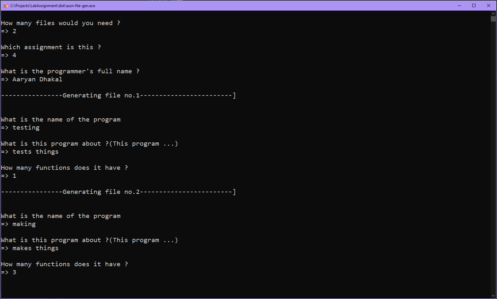
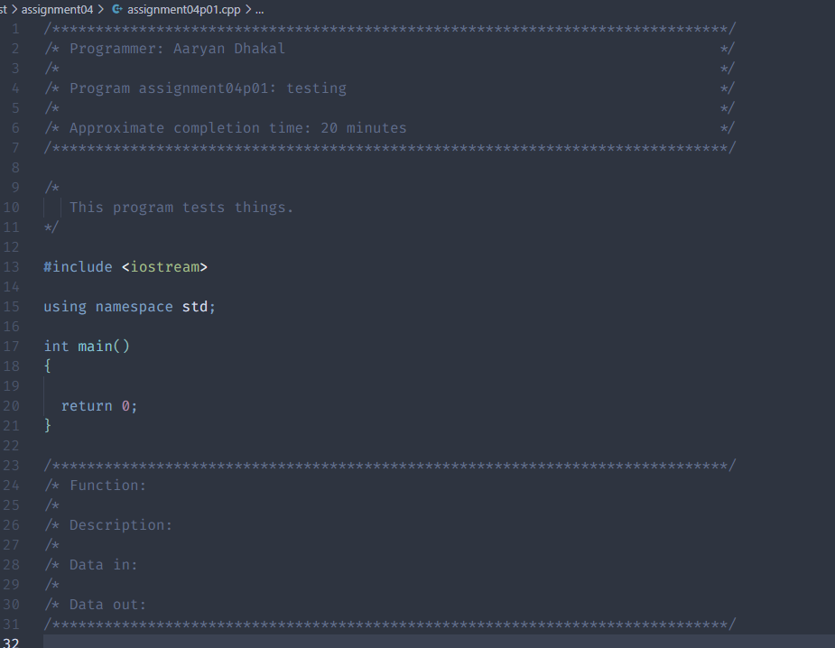
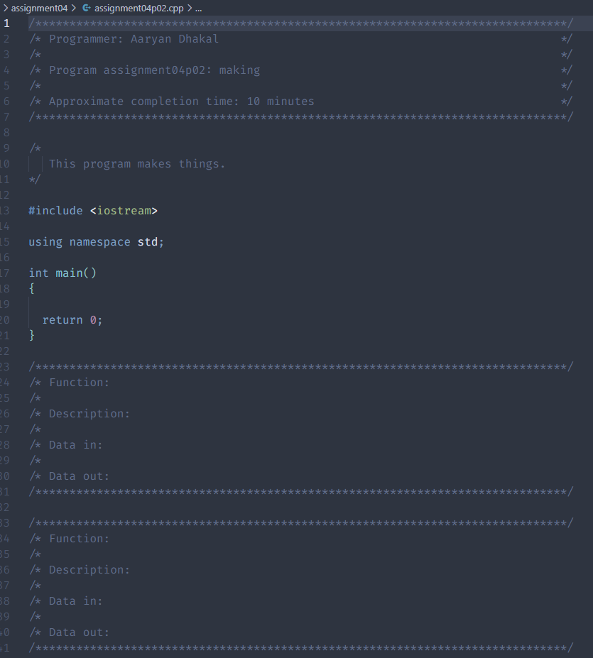

# :factory: ASSN-FILE-GEN

Generates files for assignment and saves them to a folder.
The structure and the file naming is dependent on the latest C++ template provided by the professor.

## Build script: 
``` 
    pip install pyinstaller
    cd assn_file_gen/
    pyinstaller cli.py --onefile -i logo.ico -n assn-file-gen
```
Run the ``` assn-file-gen.exe ``` and the folder and files should appear at the same location as the .exe file.


## How does it work ? 
It asks a bunch of questions about the assignment:



Generates the templated folder structure: 


And the generated files look something like this: 

testing.cpp                         |  making.cpp
:----------------------------------:|:-------------------------:
  |  
## TECHNOLOGY USED
 - Python

## FAQ 
<details>

 <summary>Which class is this for ?</summary>
  This is for the Programming and Problem Solving [CSIS 2610]

</details>
<details>

 <summary>How does it handle the time taken ?</summary>
  It just generates a random number between 10 and 30 :wink:

</details>


 